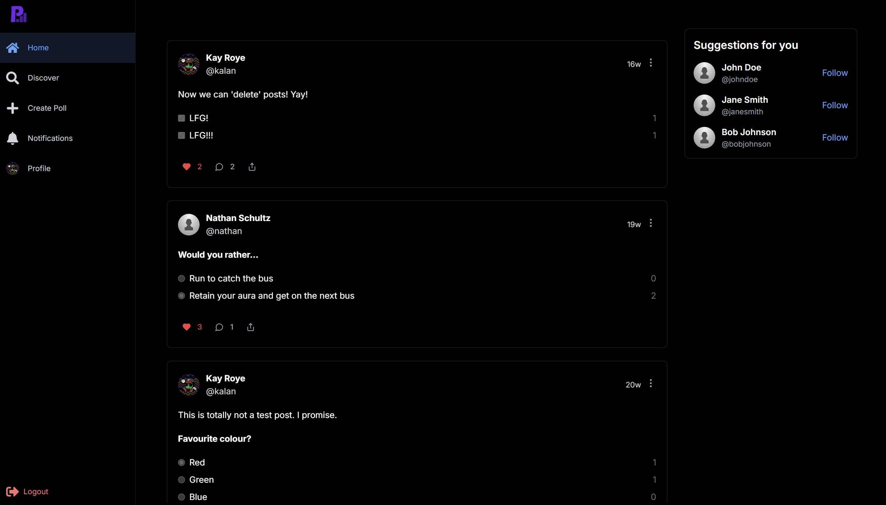
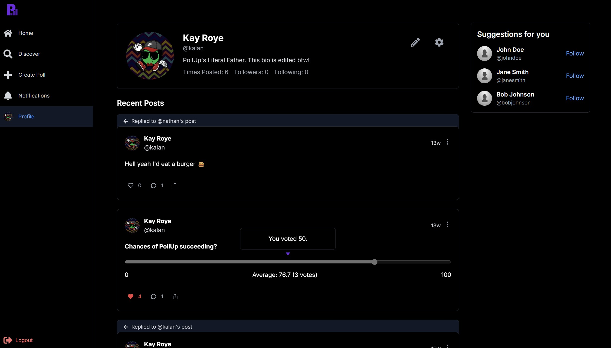
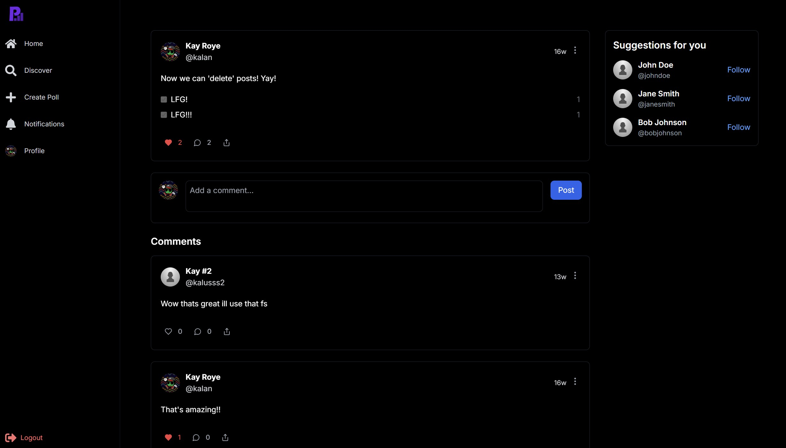

<div align="center">

# PollUp
### Create, Share, and Engage with Interactive Polls

A modern web application that allows users to create and participate in polls, share opinions, and engage with a community. Built with Next.js, React, and MongoDB, this platform makes polling intuitive and social.

[Demo](https://pollup-v1-dev.vercel.app/) · [Bug Report](https://github.com/kayroye/PollUp/issues)


</div>

## 📸 Screenshots

### Home Feed

*Interactive feed with polls and posts from the community*

### User Profile

*Personalized user profiles with activity history*

### Thread View

*Detailed view of polls with comments and engagement metrics*

## ✨ Features

<details>
<summary>📊 Poll Creation & Interaction</summary>

- Create different types of polls (single choice, multiple choice, slider)
- Set poll closing times
- Vote on polls and see real-time results
- Comment on polls and engage with other users
- Share polls with friends
</details>

<details>
<summary>👤 User Profiles & Social Features</summary>

- Customizable user profiles
- Follow other users
- Activity feed with posts from followed users
- Notifications for interactions
- User discovery
</details>

<details>
<summary>🔍 Content Discovery</summary>

- Home feed with latest polls
- Search functionality
- Trending polls and topics
- Suggested users to follow
- Bookmark favorite polls
</details>

<details>
<summary>🎨 User Experience</summary>

- Responsive design for mobile and desktop
- Dark mode support
- Intuitive navigation
- Real-time updates
- Accessibility features
</details>

## 🛠️ Tech Stack

- **Frontend**: Next.js, React, Tailwind CSS, shadcn/ui
- **Backend**: Next.js API Routes, GraphQL with Apollo
- **Database**: MongoDB
- **Authentication**: Clerk
- **Deployment**: Vercel

## 🚀 Getting Started

### Prerequisites

- Node.js 18+
- npm/yarn
- MongoDB instance
- Clerk account for authentication

### Installation

1. Clone the repository

```bash
git clone https://github.com/kayroye/PollUp.git
```

2. Install dependencies
```bash
cd pollup
npm install
```

3. Set up environment variables
```bash
cp .env.example .env.local
```

Fill in your environment variables with your MongoDB connection string and Clerk API keys.

4. Run the development server
```bash
npm run dev
```

Visit [http://localhost:3000](http://localhost:3000) to see the application.

## 📄 License

This project is licensed under the [Creative Commons Attribution-NonCommercial 4.0 International License](https://creativecommons.org/licenses/by-nc/4.0/) - see the [LICENSE](LICENSE) file for details.

This means you are free to:
- Share — copy and redistribute the material in any medium or format
- Adapt — remix, transform, and build upon the material

Under the following terms:
- Attribution — You must give appropriate credit, provide a link to the license, and indicate if changes were made
- NonCommercial — You may not use the material for commercial purposes

## 🙏 Acknowledgments

- [Next.js](https://nextjs.org) for the React framework
- [MongoDB](https://mongodb.com) for the database
- [Clerk](https://clerk.dev) for authentication
- [shadcn/ui](https://ui.shadcn.com) for UI components
- [Tailwind CSS](https://tailwindcss.com) for styling
- [Apollo GraphQL](https://apollographql.com) for data fetching